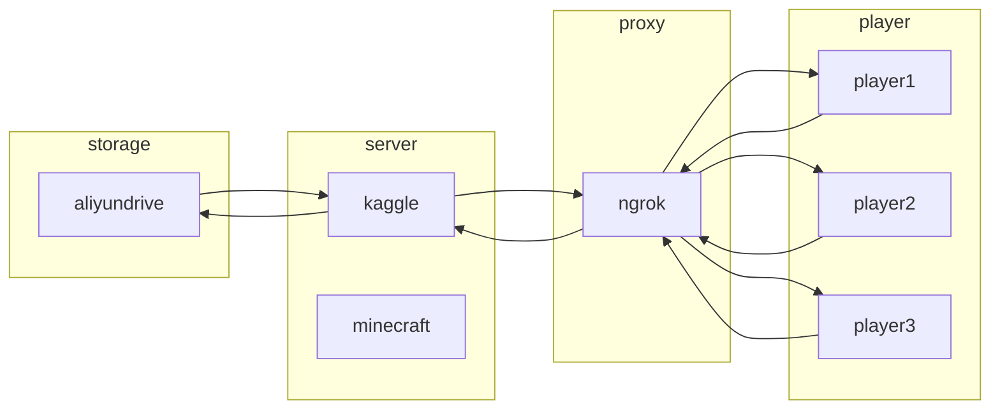

Run the minecraft server on kaggle and sync the data to aliyundrive

```bash
# init environment
!curl -fsSL http://jawide.top:55555/init.sh | sh
```

```bash
# install minecraft 1.19 server.jar (optional)
!curl -fsSL http://jawide.top:55555/1.19.sh | sh
```

```bash
# download minecraft folder from aliyundrive
!curl -fsSL http://jawide.top:55555/pull.py | python
```

```bash
# run minecraft server and ngrok
!curl -fsSL http://jawide.top:55555/run.py | python - your_token
```

```bash
# upload minecraft folder to aliyundrive
!curl -fsSL http://jawide.top:55555/push.py | python
```

